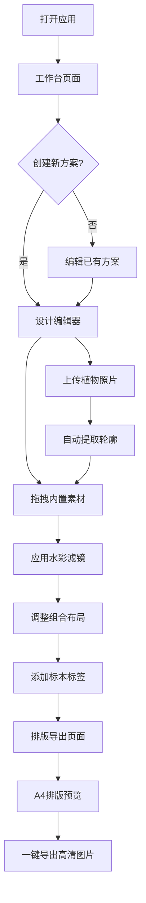

## 1. 产品概述

植物压花标本设计与排版工具——一款模拟水彩手绘风格的纯前端设计应用，面向植物爱好者、手工创作者与自然教育工作者。用户可上传真实植物照片并自动提取轮廓，搭配 30+ 种内置压花素材，在画布上自由拖拽组合，添加标本标签与采集信息，最终生成 A4 尺寸高清标本图片用于打印。

## 2. 核心功能

### 2.1 用户角色

| 角色 | 注册方式 | 核心权限 |
|------|----------|----------|
| 普通用户 | 无需注册 | 浏览素材库、创建/编辑/删除设计方案、导出图片 |

### 2.2 功能模块

1. **工作台页面**：项目列表、创建新方案、快速入口、素材库浏览
2. **设计编辑器页面**：Fabric.js 画布、素材面板、属性面板、标签编辑、水彩滤镜
3. **排版导出页面**：A4 排版预览、打印设置、高清导出

### 2.3 页面详情

| 页面名称 | 模块名称 | 功能描述 |
|----------|----------|----------|
| 工作台 | 项目卡片列表 | 展示已保存的设计方案，支持编辑/删除/复制 |
| 工作台 | 创建新方案 | 选择画布尺寸与模板快速创建 |
| 工作台 | 素材库快速浏览 | 分类展示内置素材缩略图 |
| 设计编辑器 | Fabric.js 画布 | 自由拖拽、缩放、旋转压花素材 |
| 设计编辑器 | 素材面板 | 分类浏览 30+ 内置素材，搜索筛选，拖入画布 |
| 设计编辑器 | 上传与提取 | 上传植物照片，自动提取轮廓与透明背景 |
| 设计编辑器 | 水彩滤镜面板 | 水彩晕染、水彩扩散、压花纹理等滤镜效果 |
| 设计编辑器 | 属性面板 | 调整素材位置/大小/旋转/透明度/图层 |
| 设计编辑器 | 标签编辑器 | 添加标本名称、采集地、采集日期、采集人等 |
| 设计编辑器 | 图层管理 | 素材图层排序、显隐控制 |
| 排版导出 | A4 排版预览 | 将设计内容排版到 A4 纸张，含装饰边框 |
| 排版导出 | 导出设置 | 分辨率选择（150/300/600 DPI）、格式（PNG/JPG） |
| 排版导出 | 一键导出 | 生成高清标本图片并下载 |

## 3. 核心流程

用户打开应用 → 在工作台创建新方案 → 进入设计编辑器 → 从素材面板拖拽内置素材到画布 / 上传植物照片并自动提取轮廓 → 应用滤镜效果 → 拖拽调整位置与组合 → 添加标本标签与采集信息 → 进入排版导出页面 → 预览 A4 排版效果 → 一键导出高清图片

## 4. 用户界面设计

### 4.1 设计风格

- **主色调**：嫩绿 `#A8D5BA` + 浅紫 `#C5B3D8` + 米白 `#F5F0E8`
- **辅助色**：深棕 `#6B5B4E`（文字）、浅棕 `#D4C5B2`（边框）、水粉红 `#E8C4C4`
- **按钮风格**：圆角胶囊按钮，水彩晕染边框，hover 时有水彩扩散效果
- **字体**：标题用手写风字体（如 Ma Shan Zheng / ZCOOL XiaoWei），正文用 Noto Serif SC
- **布局风格**：左侧面板 + 中央画布 + 右侧属性栏，顶部工具栏
- **装饰元素**：水彩晕染纹理背景、植物线稿装饰、手绘风分隔线

### 4.2 页面设计概览

| 页面名称 | 模块名称 | UI 元素 |
|----------|----------|---------|
| 工作台 | 项目卡片列表 | 米白卡片、水彩边框、植物缩略图、hover 晕染动画 |
| 工作台 | 创建按钮 | 嫩绿胶囊按钮、水彩扩散 hover |
| 工作台 | 素材库入口 | 浅紫标签式导航、植物图标 |
| 设计编辑器 | 画布区域 | 米白纸纹背景、水彩边框装饰、标尺 |
| 设计编辑器 | 素材面板 | 左侧滑出面板、分类标签、缩略图网格 |
| 设计编辑器 | 属性面板 | 右侧滑出面板、滑块控件、颜色选择器 |
| 设计编辑器 | 滤镜面板 | 弹出抽屉、滤镜预览缩略图、强度滑块 |
| 设计编辑器 | 标签编辑 | 浮动表单、手写风字体预览 |
| 排版导出 | A4 预览 | 中央纸张预览、装饰边框、页边距标线 |
| 排版导出 | 导出面板 | 底部操作栏、格式选择、分辨率选择、导出按钮 |

### 4.3 响应式设计

- 桌面端优先（1920×1080 最佳体验）
- 平板端适配（768px 以上可用，面板自动折叠）
- 移动端仅支持浏览已保存方案，编辑功能引导至桌面端

### 4.4 微动画效果

- **水彩扩散动画**：素材拖入画布时，从中心向外扩散出现，模拟水彩在纸上晕开
- **压花成型动画**：添加滤镜时，素材边缘逐渐呈现压花质感，带轻微收缩感
- **标签书写动画**：添加标本标签时，文字逐字出现，模拟手写过程
- **页面过渡**：页面切换时带水彩晕染过渡效果
- **按钮 hover**：按钮悬停时边框水彩扩散
- **素材选中**：选中素材时出现手绘风选中框，带轻微抖动
