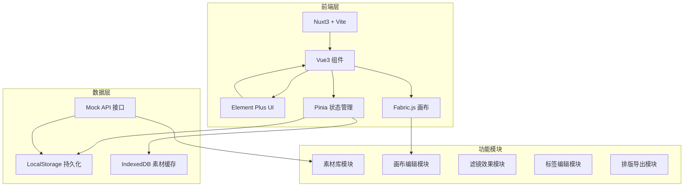
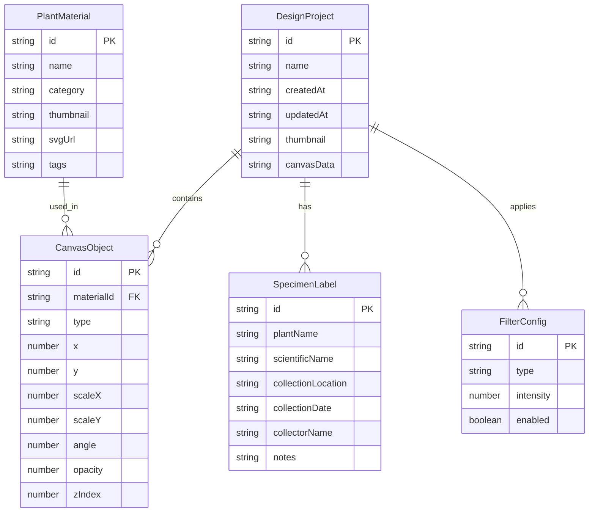

## 1. 架构设计



## 2. 技术说明

- **前端框架**：Nuxt3 + Vite（SSR 关闭，纯 SPA 模式）
- **UI 框架**：Element Plus（按需引入）
- **画布引擎**：Fabric.js v6（Canvas 2D 操作）
- **状态管理**：Pinia
- **图像处理**：Canvas API 实现轮廓提取与透明背景、水彩滤镜
- **图标**：lucide-vue-next
- **字体**：Google Fonts（Ma Shan Zheng、ZCOOL XiaoWei、Noto Serif SC）
- **数据持久化**：LocalStorage（方案数据）+ IndexedDB（素材缓存）
- **模拟接口**：基于 localStorage 的 Mock API，模拟素材库加载与作品存储

## 3. 路由定义

| 路由 | 用途 |
|------|------|
| `/` | 工作台页面，展示项目列表与快速入口 |
| `/editor/:id` | 设计编辑器，核心画布操作页面 |
| `/export/:id` | 排版与导出页面，A4 预览与高清导出 |
| `/gallery` | 素材库浏览页面（全屏浏览素材） |

## 4. API 定义（模拟接口）

### 4.1 素材库接口

```typescript
interface PlantMaterial {
  id: string
  name: string
  category: 'flower' | 'leaf' | 'grass' | 'fruit' | 'branch' | 'fern'
  thumbnail: string
  svgUrl: string
  tags: string[]
}

interface MaterialCategory {
  key: string
  label: string
  icon: string
}

// GET /api/materials - 获取素材列表
type GetMaterialsResponse = PlantMaterial[]
// GET /api/materials/:id - 获取素材详情
type GetMaterialResponse = PlantMaterial
// GET /api/categories - 获取素材分类
type GetCategoriesResponse = MaterialCategory[]
```

### 4.2 作品存储接口

```typescript
interface DesignProject {
  id: string
  name: string
  createdAt: string
  updatedAt: string
  thumbnail: string
  canvasData: string
  labels: SpecimenLabel[]
  filters: FilterConfig[]
}

interface SpecimenLabel {
  id: string
  plantName: string
  scientificName: string
  collectionLocation: string
  collectionDate: string
  collectorName: string
  notes: string
}

interface FilterConfig {
  type: 'watercolor' | 'diffuse' | 'texture' | 'vintage'
  intensity: number
  enabled: boolean
}

// GET /api/projects - 获取作品列表
type GetProjectsResponse = DesignProject[]
// GET /api/projects/:id - 获取作品详情
type GetProjectResponse = DesignProject
// POST /api/projects - 创建作品
type CreateProjectRequest = Partial<DesignProject>
type CreateProjectResponse = DesignProject
// PUT /api/projects/:id - 更新作品
type UpdateProjectRequest = Partial<DesignProject>
type UpdateProjectResponse = DesignProject
// DELETE /api/projects/:id - 删除作品
type DeleteProjectResponse = { success: boolean }
```

## 5. 数据模型

### 5.1 数据模型定义



## 6. 目录结构

```
src/
├── components/
│   ├── canvas/          # 画布相关组件
│   │   ├── FabricCanvas.vue
│   │   ├── CanvasToolbar.vue
│   │   └── LayerPanel.vue
│   ├── materials/       # 素材相关组件
│   │   ├── MaterialPanel.vue
│   │   ├── MaterialCard.vue
│   │   └── MaterialCategory.vue
│   ├── filters/         # 滤镜相关组件
│   │   ├── FilterPanel.vue
│   │   └── FilterPreview.vue
│   ├── labels/          # 标签相关组件
│   │   ├── LabelEditor.vue
│   │   └── LabelPreview.vue
│   ├── export/          # 导出相关组件
│   │   ├── A4Preview.vue
│   │   └── ExportPanel.vue
│   └── common/          # 通用组件
│       ├── WatercolorBg.vue
│       └── AnimatedButton.vue
├── composables/         # 组合式函数
│   ├── useFabric.ts
│   ├── useMaterials.ts
│   ├── useFilters.ts
│   ├── useProject.ts
│   └── useExport.ts
├── pages/               # 页面
│   ├── index.vue        # 工作台
│   ├── editor/[id].vue  # 编辑器
│   ├── export/[id].vue  # 导出页
│   └── gallery.vue      # 素材库
├── stores/              # Pinia 状态
│   ├── project.ts
│   ├── material.ts
│   └── editor.ts
├── mock/                # 模拟数据与接口
│   ├── materials.ts
│   └── api.ts
├── utils/               # 工具函数
│   ├── imageProcess.ts
│   ├── filterEffects.ts
│   └── exportUtils.ts
├── types/               # 类型定义
│   └── index.ts
└── assets/              # 静态资源
    ├── textures/        # 水彩纹理
    └── styles/          # 全局样式
```
